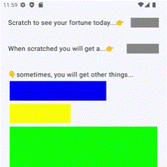
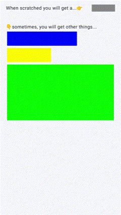
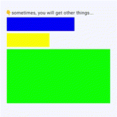
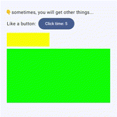
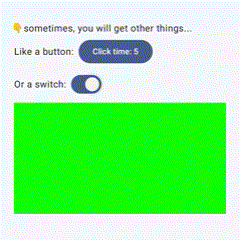

# Scratchable

[](https://jitpack.io/#NielsLee/Scratchable)

 A Compose library for a container with scratchable surface

- Set up customizable colored scratchable surfaces on other composable components,

 

- Customizable behavior after cover surface being completely scratched off



- Cover has no influence with the function of below composable components after being scratched off





## Setup

Add this library to your project using Gradle. Add it in your root build.gradle at the end of repositories:
```groovy
	dependencyResolutionManagement {
		repositoriesMode.set(RepositoriesMode.FAIL_ON_PROJECT_REPOS)
		repositories {
			mavenCentral()
			maven { url 'https://jitpack.io' }
		}
	}
```
Then add the dependency, [see the release list](https://github.com/NielsLee/Scratchable/releases):
```groovy
	dependencies {
	        implementation 'com.github.NielsLee:Scratchable:{$latest-release}'
	}
```

## Usage
This library provide only one composable components: **Scratchable**, You can wrap it around any place 
where you want to add a scratchable surface:
```kotlin
Scratchable {
    Text("Something under scratchable surface")
}
```
You can customize the behavior of scratchable surface by parameters, here is a list of all the 
available parameters:

| Parameter              | Description                                                   |
|------------------------|---------------------------------------------------------------|
| `modifier`             | The modifier to be applied to this layout                    |
| `scratcherRadius`      | Radius of the circular scratcher                              |
| `cover`                | The color of the cover surface                                |
| `movingThresholdMillis`| Time (in milliseconds) required to display the entire content while scratching |
| `coverExitTransition`  | Exit transition of the cover surface when the moving threshold is reached |
| `onFinished`           | Callback function to be invoked when the moving threshold is reached |
| `contentAlignment`     | Alignment of content inside the container                     |
| `content`              | Content of the container (composable function)                |

## Demo
**sample** directory is a demo app for this library, build & run then you can try this library on your 
Android device. 
